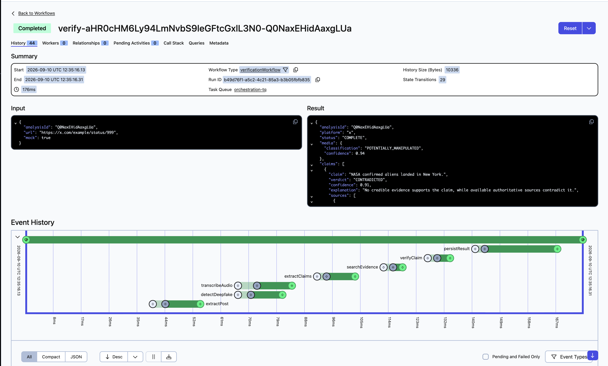

# sVerify

A social-media content verification platform. Paste a public **Facebook, Instagram, or X**
post URL and get back:

1. Whether the media is potentially AI-generated / manipulated
2. Whether the claims in the post are supported or contradicted by evidence
3. An overall risk rating
4. A plain-English explanation with sources

## How it works, in plain terms

There are three kinds of processes in this system, and they only ever talk to each
other through **Temporal** — never directly:

- **The API** (`apps/api`) is the only public-facing piece. It never does any real
  work itself. When a request comes in, it just tells Temporal "start this workflow"
  and immediately responds — it doesn't wait around for the pipeline to finish.
- **`orchestration-worker`** is the only process that runs the actual pipeline logic
  (`verificationWorkflow`). Think of it as the recipe: "first extract the post, then
  check the media, then extract and verify claims, then save the result." It never
  does real I/O itself — no HTTP calls, no database writes.
- **Four activity workers** (`extraction-worker`, `ml-worker`, `llm-worker`,
  `io-worker`) each do exactly one kind of real work — scraping, calling Hugging
  Face endpoints, calling the search API/Qdrant, writing to Postgres. The workflow
  never calls their code directly; it just asks Temporal to run a named step (e.g.
  `detectDeepfake`) on that worker's queue, and waits for the result.

```
        API                      Temporal Server                    Workers
  ┌───────────────┐            ┌──────────────────┐          ┌─────────────────────┐
  │ POST /verify  │──starts──▶ │  orchestration-tq │ ───────▶ │ orchestration-worker │
  │ (returns      │            │                  │          │ runs verificationWorkflow
  │  immediately) │            │  extraction-tq   │◀────────▶│ extraction-worker    │
  └───────────────┘            │  ml-tq           │◀────────▶│ ml-worker            │
        ▲                      │  llm-tq          │◀────────▶│ llm-worker           │
        │ polls                │  io-tq           │◀────────▶│ io-worker            │
        │                      └──────────────────┘          └─────────────────────┘
  GET /verify/:id
```

Every worker is already running and continuously polling its own queue *before* any
request arrives — nothing gets "started" per request, only tasks get placed on a
queue for an already-listening worker to pick up. If a worker crashes mid-step,
Temporal just re-delivers that one step once a worker reconnects — nothing is lost,
and the rest of the pipeline doesn't need to restart.

Here's what a finished run actually looks like in the Temporal Web UI (`localhost:8088`) —
notice the queue name (`orchestration-tq`), and every activity the workflow ran, in order,
with its own timing:



## Repo layout

```
apps/
  web/                         Next.js frontend (App Router, Tailwind)
  api/                         Fastify API - Temporal client, REST endpoints
  extraction-sidecar/          Standalone HTTP service: platform scraping only (X syndication
                               API + yt-dlp for FB/IG). No S3/Temporal knowledge - see its
                               own src/platforms/* per-platform extractors.
engine/
  workflows/                   The workflow definition, activity interfaces, and risk engine -
                               this is the pipeline's "plan": what runs, in what order, with
                               what retry/timeout policy per step.
  workers/
    orchestration-worker/      Runs the workflow itself (no activities)
    extraction-worker/         Activity: extractPost (thin client of extraction-sidecar + S3 upload)
    ml-worker/                 Activities: detectDeepfake, transcribeAudio (→ HF)
    llm-worker/                Activities: extractClaims, searchEvidence, verifyClaim (→ HF + Qdrant)
    io-worker/                 Activity: persistResult (→ Postgres)
packages/
  schemas/                     Shared Zod types (Claim, Verdict, VerificationResult, ...)
  clients/                     Shared HF/S3/Qdrant/Redis client wrappers + Temporal identity helper
  mocks/                       Canned demo data used when a request sets `x-mock: true`
infra/
  podman-compose.yml           Local infra: Temporal, Temporal UI, Postgres x2, Qdrant, MinIO, Redis
  k8s/                         (future) production manifests
```

**Why extraction is its own sidecar service:** `apps/extraction-sidecar` only scrapes a
platform post (X/Twitter via the public syndication API, Instagram/Facebook via yt-dlp) and
returns metadata + downloadable media URLs — no S3, no Temporal. `extraction-worker`'s
activity is a thin client of it: call the sidecar, download the media, upload to S3. This
keeps the part of the system most likely to break (platforms changing their markup/APIs)
independently testable via plain HTTP, without touching Temporal at all.

**Why no ML models run locally:** all inference (deepfake detection, Whisper, BGE-M3, the
verification/claim-extraction LLM) happens on Hugging Face Inference Endpoints, called over
plain HTTP from `ml-worker`/`llm-worker`. This repo never loads model weights itself.

**Why the risk engine isn't an LLM call:** `engine/workflows/src/risk-engine.ts` is a pure,
deterministic TypeScript function, executed inline in the workflow — same input always
gives the same LOW/MEDIUM/HIGH/UNABLE_TO_DETERMINE output, no model involved.

## Prerequisites

- Node.js ≥ 20, `pnpm`
- `podman` + `podman-compose` (Docker Compose works too, same file)
- `yt-dlp` on the machine running `extraction-sidecar` (Instagram/Facebook only —
  X/Twitter uses the public syndication API and needs no yt-dlp): `brew install yt-dlp`
- `ffmpeg` on the machine running `ml-worker` (audio extraction): `brew install ffmpeg`
- Hugging Face Inference Endpoints for: deepfake classifier, Whisper large-v3-turbo,
  BGE-M3, and an LLM — URLs + token go in `.env`
- A web search API key (Bing Search / SerpAPI / Google CSE) for evidence retrieval

## Setup

```bash
pnpm install
cp .env.example .env        # fill in HF endpoint URLs, search API key, etc.
cp apps/web/.env.local.example apps/web/.env.local   # points the UI at the API

# symlink .env into every app/worker so `dotenv/config` finds it regardless of cwd
for d in apps/api apps/extraction-sidecar engine/workers/*; do ln -sf "$(python3 -c "import os;print(os.path.relpath('.env', '$d'))")" "$d/.env"; done
```

### 1. Start infra containers

```bash
pnpm infra:up      # podman-compose -f infra/podman-compose.yml up -d
```

This brings up:

| Container | Port | Purpose |
|---|---|---|
| `sverify-temporal` | 7233 | Temporal server (gRPC frontend) |
| `sverify-temporal-ui` | 8088 | Temporal Web UI — http://localhost:8088 |
| `sverify-temporal-postgres` | (internal) | Temporal's own backing store |
| `sverify-app-postgres` | 5432 | App data (`analyses` table) |
| `sverify-qdrant` | 6333/6334 | Vector DB for evidence retrieval |
| `sverify-minio` | 9000/9001 | S3-compatible media storage — console at :9001 |
| `sverify-redis` | 6379 | Caches COMPLETE verify results by URL — see "Verify-result caching" below |

One-time: create the MinIO bucket used for downloaded media:

```bash
podman exec sverify-minio mc alias set local http://localhost:9000 sverify sverify123
podman exec sverify-minio mc mb local/sverify-media
```

Check everything's healthy:

```bash
podman ps --format "table {{.Names}}\t{{.Status}}"
```

### 2. Start the API + workers (all run on the host, separate terminals)

```bash
pnpm dev:api                     # Fastify API on :4100 (see .env PORT)
pnpm dev:web                     # Next.js UI on :3000
pnpm dev:extraction-sidecar      # Platform scraping HTTP service on :4200 (needs yt-dlp for FB/IG)
pnpm dev:worker:orchestration    # runs the workflow
pnpm dev:worker:extraction       # thin client of extraction-sidecar (EXTRACTION_SIDECAR_URL)
pnpm dev:worker:ml               # needs ffmpeg + HF endpoint env vars
pnpm dev:worker:llm              # needs HF LLM endpoint + search API + Qdrant
pnpm dev:worker:io               # writes results to Postgres
```

Each worker only needs the env vars relevant to what it does (see `.env.example`).
You can run a subset while developing — the workflow will simply stay `RUNNING`,
parked on whichever task queue has no worker yet (visible in the Temporal UI).

Or bring everything up in one shot with `./start.sh` (tears down with `./stop.sh`,
check status with `./status.sh`).

## Request flow, end to end

```
1. POST /api/v1/verify { "url": "..." }
     API generates an analysisId, checks the Redis cache for this URL:
       - cache HIT  → returns the cached result under a new analysisId, no workflow started
       - cache MISS → starts verificationWorkflow, inserts a PENDING Postgres row,
                       responds 202 { analysisId } immediately (does not wait)

2. orchestration-worker runs verificationWorkflow:
     a. extraction.extractPost(url)                       [extraction-tq]
     b. if a video/image exists:
          ml.detectDeepfake(...) + ml.transcribeAudio(...) [ml-tq], concurrently
     c. llm.extractClaims(text, transcript)                [llm-tq]
     d. for each claim, concurrently:
          llm.searchEvidence(claim) → llm.verifyClaim(claim, evidence)  [llm-tq]
     e. computeOverallRisk(media, claims)                  — pure function, no activity
     f. io.persistResult(analysisId, url, result)          [io-tq]
          → also write-through caches COMPLETE results in Redis

3. GET /api/v1/verify/:analysisId  (polled by the UI every 3s)
     - if already COMPLETE/FAILED in Postgres → returned directly, no Temporal call
     - otherwise asks Temporal directly (handle.describe()) for RUNNING/COMPLETED/FAILED
```

Every activity has its own **task queue**, **timeout**, **retry policy**, and (for the
long-running ones) **heartbeat**, all configured in `engine/workflows/src/workflows.ts`.
Non-retryable extraction errors (invalid URL, private, deleted) short-circuit straight to
a `FAILED` result instead of retrying something that can never succeed.

## Verify-result caching

Submitting the same post URL twice while a result for it is still cached skips the entire
pipeline and returns the cached result under a fresh `analysisId`:

- **Where:** `apps/api/src/routes/verify.ts` checks the cache before starting a workflow;
  `engine/workers/io-worker/src/activities/persist-result.ts` writes it after one finishes.
- **Key:** SHA-256 of the trimmed URL. **TTL:** `VERIFY_CACHE_TTL_SECONDS` (default 1 hour).
- Only genuine `COMPLETE` results are cached — `FAILED` results aren't, since failures are
  often transient and worth retrying rather than being stuck for an hour.
- **Fail-open:** if Redis is down, caching is silently skipped — never blocks verification.

## Testing without external dependencies

Sending `x-mock: true` as a header on `POST /api/v1/verify` makes every activity return
canned demo data instead of doing real I/O (no yt-dlp, no ffmpeg, no Hugging Face, no
search, no Qdrant) — useful for exercising the full Temporal pipeline before any real
credentials are configured. Canned data lives in `packages/mocks`. Mock requests never
read or write the verify-result cache.

## What's implemented vs. stubbed

| Component | Status |
|---|---|
| API (`POST/GET /verify`) | Working, tested end-to-end against live Temporal |
| Temporal workflow + risk engine | Working, typechecked, smoke-tested |
| `extraction-worker` (yt-dlp) | Implemented; needs `yt-dlp` installed to actually run |
| `ml-worker` (deepfake/whisper/embeddings) | Implemented as HF HTTP clients; needs real HF Endpoint URLs |
| `llm-worker` (claims/evidence/verification) | Implemented; needs HF LLM endpoint + search API key |
| `io-worker` (Postgres persistence) | Working; also write-through caches COMPLETE results in Redis |
| Frontend | Implemented (Next.js, `apps/web`) — polls `/verify/:id` and renders risk/media/claims/evidence |
| Facebook/Instagram extraction reliability | Expect a high `PRIVATE_OR_LOGIN_REQUIRED` / `EXTRACTION_FAILED` rate — yt-dlp support for these platforms is weaker than for X |

## Useful local commands

### Temporal worker/client identities

Every process that talks to Temporal (the API and all 5 workers) sets an explicit,
readable `identity` via `buildIdentity()` in `packages/clients/src/identity.ts`,
instead of the SDK's default `<hostname>:<pid>`. In the Temporal UI / `tctl` event
history you'll see clear names like:

```
sverify-api@my-laptop#96028
sverify-orchestration-worker@my-laptop#96049
sverify-extraction-worker@my-laptop#96056
sverify-ml-worker@my-laptop#96042
sverify-llm-worker@my-laptop#96034
sverify-io-worker@my-laptop#96061
```

rather than six indistinguishable entries all showing your machine's hostname. The
hostname+pid suffix is kept only so multiple replicas of the same worker (e.g. 3x
`llm-worker` for throughput) still show up as distinct pollers.

```bash
# Tail all infra logs
pnpm infra:logs

# Temporal Web UI
open http://localhost:8088

# MinIO console
open http://localhost:9001   # user: sverify / pass: sverify123

# Inspect a workflow from the CLI
podman exec sverify-temporal tctl --address temporal:7233 --ns default workflow list

# Tear down infra (keeps volumes)
pnpm infra:down
```

## Environment variables

See `.env.example` for the full list. Summary:

- `TEMPORAL_ADDRESS`, `TEMPORAL_NAMESPACE` — Temporal server connection
- `DATABASE_URL` — app Postgres
- `S3_*` — MinIO/S3 connection + bucket for downloaded media
- `QDRANT_URL`, `QDRANT_EVIDENCE_COLLECTION` — evidence vector store
- `REDIS_URL`, `VERIFY_CACHE_TTL_SECONDS` — verify-result cache
- `HF_API_TOKEN`, `HF_DEEPFAKE_ENDPOINT_URL`, `HF_WHISPER_ENDPOINT_URL`,
  `HF_EMBEDDING_ENDPOINT_URL`, `HF_LLM_ENDPOINT_URL` — Hugging Face Inference Endpoints
- `SEARCH_API_URL`, `SEARCH_API_KEY` — web search for evidence retrieval
- `PORT` — API port (default 4000; local dev uses 4100 to avoid a port clash — check `.env`)

## Acceptance criteria this scaffold targets

See the original project plan for AC1–AC10. Notably:

- **AC10 (failure handling)** is enforced structurally: `extractPost` throws typed
  `ApplicationFailure`s (`INVALID_URL`, `UNSUPPORTED_PLATFORM`, `PRIVATE_OR_LOGIN_REQUIRED`,
  `DELETED_OR_NOT_FOUND`) which are marked **non-retryable** in the workflow's retry policy,
  so the workflow fails fast with a structured error instead of fabricating a result.
- **AC9 (overall risk)** is computed by a pure, unit-testable function
  (`computeOverallRisk`), not an LLM.
